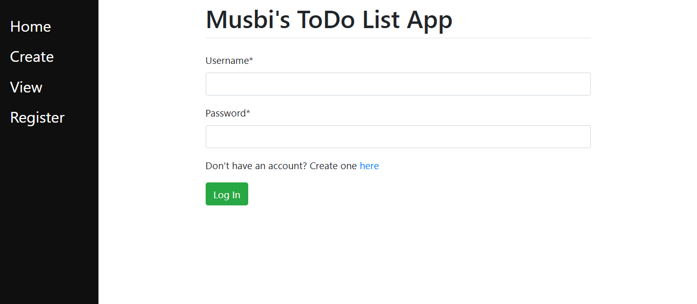

# TODo list application
This is my first django mini project

## Screenshot
``` home page```


``` create page before logging in ```


``` create page after logging in ```


``` register page ```

``` to do list ```


    


## How the project works
 1. ``` main ``` folder respond to the the home, view, and create page
 2. ``` mysite ``` folder respond for the project root such as rendering pages 
 3. ``` register `` folder respond for registrations 

To create a to do list first you need to create an account if you don't have it otherwise you can't view or create to do list 


